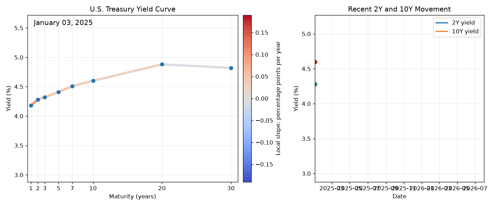
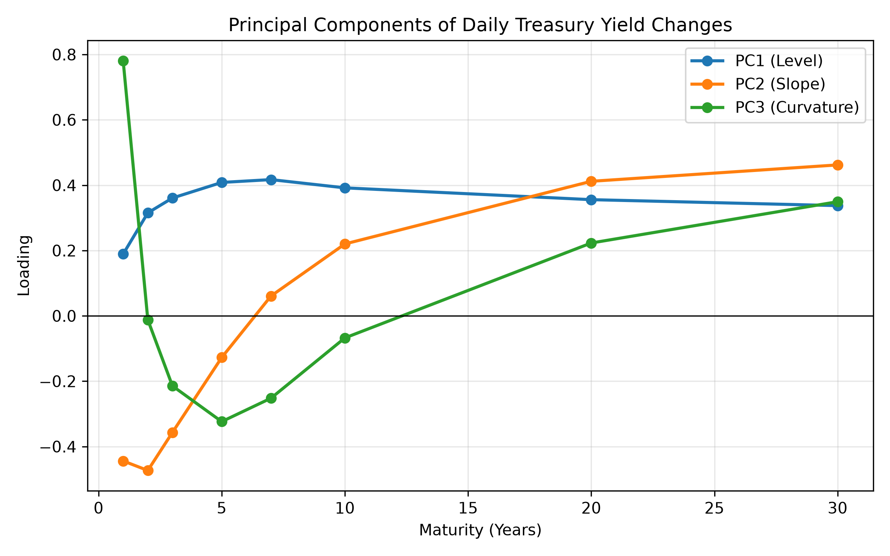
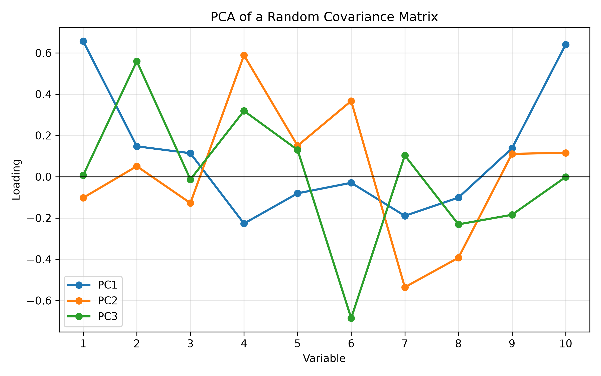
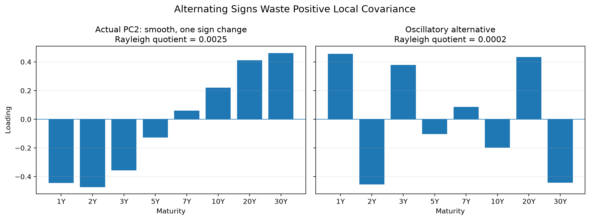
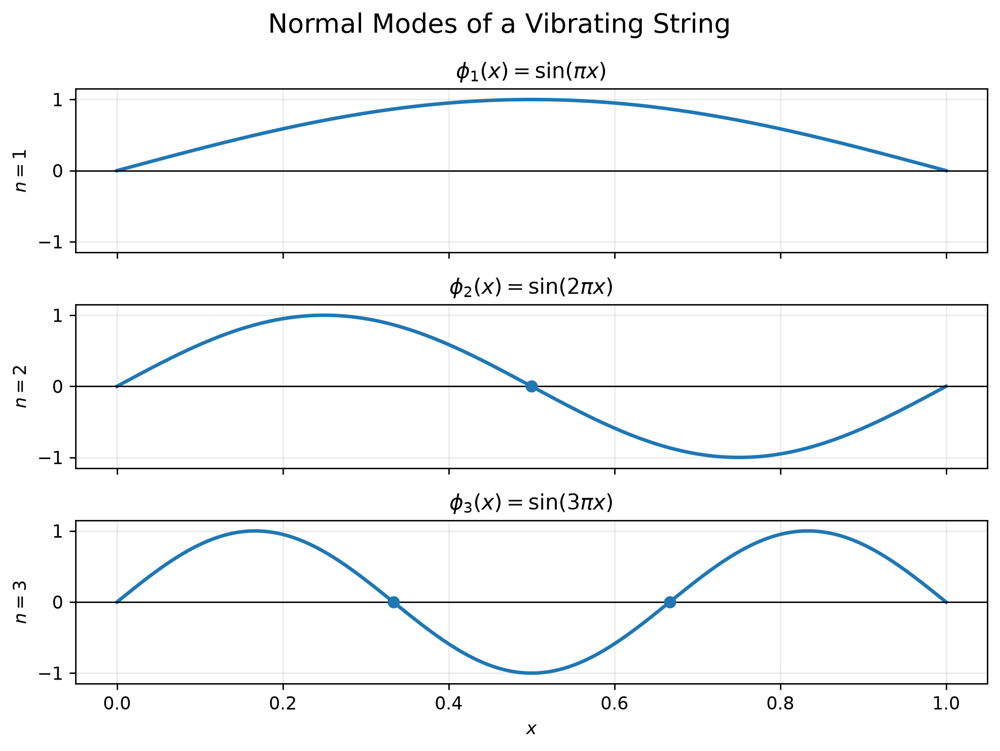
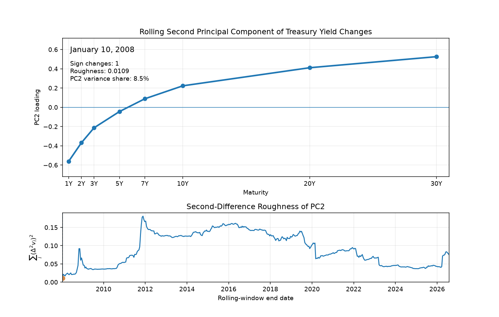


### The empirical puzzle
Over the past year I’ve spent an embarrassing amount of time staring at principal components. 
It started as a practical exercise but gradually became a mathematical curiosity of its own.
One feature kept appearing: the underlying objects almost always possessed some notion of order. 
Treasury maturities, mortgage coupons, issuing agencies—these weren’t arbitrary collections of variables. 
Nearby objects tended to respond similarly to the same disturbances, and most were positively correlated.

And when PCA is applied to such systems, the principal components don't appear random.
They seem to become progressively more oscillatory.
The U.S. Treasury yield curve provides perhaps the cleanest example.



At first glance the yield curve appears capable of deforming in infinitely many ways. 
Yet as the animation unfolds, its motion begins to feel strangely coordinated—as though it is repeatedly expressing the same handful of shapes.
PCA compresses this highly-dimensional motion into just three dominant modes.



Before worrying about what these components mean economically, notice something purely mathematical.

The first loading never changes sign.

The second changes sign exactly once.

The third changes sign exactly twice.
<!-- PC1    + + + + + + + +
          ↑ 0 crossings

PC2    - - - - + + + +
              ↑ 1 crossing

PC3    + + - - - + + +
          ↑     ↑ 2 crossings -->
Fixed-income practitioners have long interpreted these as the level, slope, and curvature [factors](https://math.nyu.edu/inmemoriam/avellaneda//Litterman1991.pdf) of the curve.
But that interpretation doesn’t answer the mathematical question. 
Why should the first loading have no sign changes, the second exactly one, and the third exactly two?

### Can PCA explain this?
<!-- Derive the eigenvalue problem and show that an arbitrary covariance matrix need not produce level, slope, and curvature. -->
<!-- To answer that question, we need to strip away the economics entirely and ask what PCA actually does. -->
Our first instinct might be that the oscillatory structure is simply a consequence of PCA itself. 
After all, the loadings are the output of the algorithm. 
Perhaps there is something inherent in the optimization problem that forces successive principal components to acquire additional sign changes.

To investigate that possibility, let’s briefly strip away the financial interpretation and recall what PCA is actually doing.

Suppose we observe a random vector
$$
X =
\begin{pmatrix}
X_1 \\ X_2 \\ \vdots \\ X_n
\end{pmatrix},
$$
with covariance matrix
$$
\Sigma = \operatorname{Cov}(X).
$$
PCA seeks the direction $v$ along which the projected data exhibits the greatest variance. 
Equivalently, it solves the optimization problem
$$
\max_{\|v\|=1} v^\top \Sigma v.
$$
The quantity
$$
R(v)
=
\frac{v^\top \Sigma v}
     {v^\top v},
$$
known as the [Rayleigh quotient](https://en.wikipedia.org/wiki/Rayleigh_quotient), measures the variance explained by projecting onto the direction $v$.
Maximizing this quotient leads directly to the familiar eigenvalue problem
$$
\Sigma v = \lambda v,
$$
whose solutions are the principal components.
<!-- Throughout the remainder of this essay we will work only with the numerator $v^\top\Sigma v$, since PCA restricts attention to unit vectors. -->

The first principal component maximizes the explained variance. 
The second maximizes the remaining variance subject to being orthogonal to the first. 
Each subsequent component repeats the process, producing an orthogonal basis ordered by decreasing variance.

So far, nothing is surprising.

What is surprising is what doesn’t appear anywhere in this derivation.

There is no notion of maturity. 
No notion of neighboring variables. No preference for smoothness. 
No penalty for oscillation. 
The mathematics of PCA merely asks for orthogonal directions that maximize variance. 
It says nothing about how many times an eigenvector should cross zero.

Indeed, if we generate an arbitrary positive semidefinite covariance matrix and compute its principal components, the resulting eigenvectors typically bear little resemblance to the elegant level, slope, and curvature factors of the yield curve.

<!-- Insert code and loadings plot -->
<!-- ```python
import numpy as np
import matplotlib.pyplot as plt
from sklearn.decomposition import PCA

# ----------------------------------------------------
# Random covariance matrix
# ----------------------------------------------------

rng = np.random.default_rng(42)
n_assets = 10
n_samples = 5000
A = rng.normal(size=(n_assets, n_assets))
Sigma = A @ A.T       # Random positive semidefinite covariance matrix
X = rng.multivariate_normal(
    mean=np.zeros(n_assets),
    cov=Sigma,
    size=n_samples,
)

# ----------------------------------------------------
# PCA
# ----------------------------------------------------

pca = PCA(n_components=3)
pca.fit(X)
components = pca.components_.copy()
# Flip signs only for readability
for i in range(3):
    if components[i].mean() < 0:
        components[i] *= -1

# ----------------------------------------------------
# Plot
# ----------------------------------------------------

plt.figure(figsize=(8,5))
x = np.arange(1, n_assets + 1)
labels = [
    "PC1",
    "PC2",
    "PC3",
]
for component, label in zip(components, labels):
    plt.plot(
        x,
        component,
        marker="o",
        linewidth=2,
        label=label,
    )
plt.axhline(0, color="black", lw=0.8)
plt.xticks(x)
plt.xlabel("Variable")
plt.ylabel("Loading")
plt.title("PCA of a Random Covariance Matrix")
plt.legend()
plt.grid(alpha=0.3)
plt.tight_layout()
plt.show()
``` -->


The implication is subtle but important.

PCA computes the loadings, but it does not explain their shape.

Whatever is responsible for the remarkably ordered oscillation pattern must therefore come from the covariance matrix itself—not from the PCA algorithm.

That observation shifts the question entirely.

Rather than asking _what does PCA do?_, we should instead ask _what is so special about the covariance structure of the yield curve?_

### Why is the first eigenvector positive?
<!-- Use positive covariance, Rayleigh quotients, and Perron–Frobenius. -->
The first clue comes from a theorem that predates PCA by several decades.

Suppose our covariance matrix has strictly positive entries,
$$\Sigma_{ij}>0.$$
This is hardly an unreasonable assumption for the yield curve. 
Nearby maturities almost always move together, and even distant maturities tend to respond in the same direction to broad macroeconomic shocks. 
The covariance matrix is therefore not merely positive semidefinite—as every covariance matrix must be—but approximately entrywise positive.

At first glance this seems like an innocuous observation. It turns out to have a remarkable consequence.

The [Perron–Frobenius theorem](https://en.wikipedia.org/wiki/Perron%E2%80%93Frobenius_theorem) states that a matrix with strictly positive entries possesses a unique largest eigenvalue, and that the corresponding eigenvector can be chosen so that every component is strictly positive.

Applied to the yield curve, this tells us immediately that the first principal component cannot oscillate. Every loading points in the same direction.

The mathematics therefore agrees perfectly with the financial interpretation. The dominant mode of variation is a parallel shift of the entire curve.

Notice what has happened.

We have explained why the first loading never changes sign without mentioning duration, monetary policy, or finance at all. 
The explanation is purely geometric. Positive covariance implies a positive leading eigenvector.

#### A variational interpretation
The theorem is elegant, but it can also feel a little magical. 
Fortunately, the Rayleigh quotient offers a more intuitive explanation.

Recall that the first principal component maximizes
$$
v^\top \Sigma v= \sum_{i,j} v_i\Sigma_{ij}v_j
$$
over the search space $\|v\|=1$.

Because every covariance term is positive, two variables carrying the same sign reinforce one another. 
Assigning opposite signs causes those same covariance terms to subtract instead.

Every unnecessary sign flip therefore destroys variance.

The maximizing vector naturally prefers to place every component on the same side of zero.

Perron–Frobenius tells us that this intuition is exact.

$$
\begin{aligned}
+ + + + + + + +      &~~~~~~~~~~✓\\
+ + - + + + + +      &~~~~~~~~~~\text{some covariance lost}\\
+ - + - + - + -      &~~~~~~~~~~\text{lots of covariance lost}
\end{aligned}
$$

Unfortunately, Perron–Frobenius only explains the first principal component.

The second eigenvector cannot also be everywhere positive. 
It must somehow avoid pointing in the same direction as the first.

That requirement introduces orthogonality as a necessary ingredient to the story.

### Why must the second component change sign?
<!-- Explain why later components must contain increasingly complicated positive and negative regions. -->
Perron–Frobenius explains why the first principal component is everywhere positive. 
It tells us nothing about the second.

Fortunately, PCA does.

By construction, every principal component after the first must be orthogonal to all those that came before it. 
In particular,
$$
v_2^\top v_1 = 0.
$$
At first this appears to be little more than a technical constraint. 
In reality, it completely changes the geometry of the problem.

We have already established that every entry of $v_1$ is strictly positive. 
Suppose, for the sake of argument, that the second eigenvector were also strictly positive. 
Then every term in the inner product
$$
v_2^\top v_1 = \sum_{i=1}^n v_{2,i}v_{1,i}
$$
would itself be positive, making the sum strictly positive.

That is impossible.

Likewise, if every entry of $v_2$ were negative, every term would be negative, making the inner product strictly negative.

The only remaining possibility is that $v_2$ contains both positive and negative entries.

Somewhere, it must cross zero.

This is our first explanation for oscillation.

$$
v_2^\top v_1 = 0 ~~~~~~\implies~~~~~~\begin{aligned}
+ + + + + + + +      &~~~~~~~~~~\text{PC1}\\
- - - - + + + +      &~~~~~~~~~~\text{PC2}
\end{aligned}
$$

Unlike the first principal component, the second cannot simply move every maturity in the same direction. 
It must divide the curve into regions that move against one another.

Financially, this is exactly what practitioners recognize as the slope factor: one end of the curve rises while the other falls.

Again, notice what we have—and have not—explained.

Orthogonality forces the second eigenvector to change sign.

It does not explain why it changes sign exactly once.

Nothing prevents a vector such as
$$
+ - + - + - + -
$$
from being perfectly orthogonal to the first eigenvector.

Indeed, infinitely many sign-changing vectors satisfy the orthogonality constraint.

So why does PCA consistently choose the smooth, gently sloping loading rather than a wildly oscillating one?

That question cannot be answered by orthogonality alone.

### Why doesn't it oscillate more?
<!-- Show that alternating adjacent signs waste covariance. -->
Orthogonality leaves us with an enormous amount of freedom.
The second principal component could divide the curve cleanly into a short-end and a long-end. 
But it could just as easily alternate signs at every maturity,
$$
+ - + - + - + -
$$
or exhibit any number of more complicated oscillatory patterns.
All of these vectors can be made orthogonal to the first principal component.

So why does PCA consistently choose the smoothest one?

The answer lies not in the orthogonality constraint, but in the quantity being maximized.

Again, recall that every principal component maximizes 
$$
v^\top \Sigma v = \sum_{i,j} v_i\Sigma_{ij}v_j.
$$
Unlike the previous section, we now need to think carefully about what each of these terms means.

The covariance matrix of the yield curve is not merely positive. 
It is also smooth.
Maturities that are close together tend to have extremely large positive covariance. 
As the distance between maturities increases, that covariance gradually decays.

In other words, the covariance matrix has a strong local structure.

Now imagine placing opposite signs on two neighboring maturities.

Because those maturities possess large positive covariance,
$$\Sigma_{ij}>0,$$
their contribution to the Rayleigh quotient becomes
$$v_i\Sigma_{ij}v_j<0.$$
Instead of reinforcing one another, they begin cancelling each other out.

Every unnecessary sign change therefore destroys explained variance. 

The optimization naturally avoids this.
Given two vectors that both satisfy the orthogonality constraint, the one with fewer sign reversals preserves more of the positive covariance structure and therefore achieves a larger Rayleigh quotient.

Smoothness wins.
<!-- insert image of yield curve PC2 versus a more oscillatory alternative -->


At this point we have only a heuristic. 
The argument explains why unnecessary oscillation is expensive, but it does not yet prove that the optimal solution must exhibit exactly one sign change, or that the third component must exhibit exactly two.

To turn this intuition into mathematics, we need to stop thinking of the yield curve as a finite vector and begin thinking of it as a continuous object.

### Is this coincidence?
<!-- Introduce functional PCA and the Karhunen–Loève expansion. -->
So far, we have developed a plausible story.

Positive covariance explains why the first principal component remains one-signed. 
Orthogonality forces the second to contain both positive and negative regions. 
Smooth local dependence then makes unnecessary oscillation expensive.

But this still leaves an uncomfortable possibility.

Perhaps the level-slope-curvature pattern is merely an empirical accident: a convenient feature of this particular covariance matrix, observed over this particular sample, in this particular market.

To see whether something deeper is happening, it helps to stop thinking of the yield curve as a finite list of maturities.

A yield curve is more naturally viewed as a function of maturity,

$$
y_t(\tau),
$$
where $t$ denotes time and $\tau$ denotes maturity.

Its daily change is therefore another function,
$$
X_t(\tau)=\Delta y_t(\tau).
$$

In practice, we observe this function only at a finite grid of maturities: one year, two years, five years, ten years, and so on. But the underlying economic object is continuous. The eight-dimensional vector used in our PCA is only a discretized picture of a curve.

Once we take that perspective seriously, the covariance matrix becomes a covariance kernel,
$$
K(s,\tau)=\operatorname{Cov}\bigl(X_t(s),X_t(\tau)\bigr).
$$
Rather than asking how two columns of a dataset covary, we can ask how shocks at any two maturities $s$ and $\tau$ move together.

This kernel defines an operator acting on functions:
$$
(\mathcal{K}\phi)(s)=\int_a^b K(s,\tau)\phi(\tau)d\tau.
$$

The functional version of PCA then asks for functions $\phi_k$ satisfying
$$
\mathcal{K}\phi_k =\lambda_k\phi_k.
$$

These _eigenfunctions_ are the continuous analogues of the PCA loading vectors. 
Instead of assigning a loading to each observed maturity, they assign a loading to every point along the curve.

The yield-curve change can then be expanded as
$$
X_t(\tau)=
\sum_{k=1}^{\infty}
Z_{t,k}\phi_k(\tau),
$$
where the coefficients $Z_{t,k}$ are uncorrelated random variables and the functions $\phi_k$ form an orthogonal basis.

This is the [Karhunen-Loève expansion](https://en.wikipedia.org/wiki/Karhunen%E2%80%93Lo%C3%A8ve_theorem): PCA for random functions.

The finite-dimensional problem has not disappeared. It has been revealed as an approximation to a more general one.

That change in perspective matters because the strange oscillatory pattern now looks less like a quirk of Treasury data and more like a spectral property of a smooth covariance operator.

The first eigenfunction is smooth and one-signed.

The second crosses zero.

The third bends back again.

Successive components become progressively more oscillatory.

We have seen this pattern before.

Not in finance, but in the vibration modes of strings, membranes, and mechanical systems.

The resemblance is not merely visual.

### Where have we seen this before?
<!-- Develop the analogy with vibrating strings and then introduce Gantmacher–Krein or total positivity. -->
Imagine plucking a guitar string.

Although the string can adopt infinitely many shapes, it does not vibrate arbitrarily. Instead, its motion decomposes into a sequence of normal modes.

The first mode contains no interior nodes.

The second contains one.

The third contains two.

Each successive mode acquires one additional zero crossing.

To a physicist, these are simply the harmonics of a vibrating string.

To us, they should look strangely familiar.

The loading vectors of the yield curve appear to follow precisely the same progression.

This is no coincidence.

The normal modes of a vibrating string arise as eigenfunctions of a differential operator. Specifically, they satisfy the [Sturm-Liouville problem](https://en.wikipedia.org/wiki/Sturm%E2%80%93Liouville_theory)
$$
-\frac{d^2\phi}{dx^2}=\mu\phi,
$$
subject to the appropriate boundary conditions.

The resulting eigenfunctions are
$$
\phi_n(x)=\sin(n\pi x),
$$
whose oscillatory structure is immediately apparent.

The first eigenfunction has no interior zero.

The second has one.

The third has two.



<!-- More generally, the Sturm Oscillation Theorem states that the $n$-th eigenfunction possesses exactly $n-1$ interior zeros. -->

The resemblance to the yield curve is difficult to ignore.

The covariance operator introduced in the previous section is not literally the same operator that governs a vibrating string. 
One measures how randomness propagates through maturity; the other describes how physical disturbances propagate through space. 
Yet both are self-adjoint operators acting on smooth one-dimensional objects, and that shared structure is enough to produce remarkably similar eigenfunctions.
<!-- Add a footnote to explain the above -->

<!-- Nevertheless, both belong to a much broader family of self-adjoint operators whose eigenfunctions become progressively more oscillatory as their associated eigenvalues decrease. -->

The natural question is therefore no longer 

_Why does PCA produce level, slope, and curvature?_

Instead it becomes 

_Under what conditions do covariance operators inherit the same oscillation hierarchy as vibrating systems?_

Remarkably, this question has already been answered.

<!-- Beginning with the work of Gantmacher and Krein in the 1930s, mathematicians studied a class of matrices and kernels known as "oscillatory" or "totally positive".  -->
Beginning in the 1930s, mathematicians studied a class of matrices and kernels known as oscillation matrices (or [totally positive](https://en.wikipedia.org/wiki/Totally_positive_matrix) operators).
These objects possess a remarkable property: their eigenvectors are ordered by the number of sign changes they contain.

In particular, the eigenvector associated with the largest eigenvalue has no sign changes.

The second has exactly one.

The third has exactly two.

More generally, the $k$-th eigenvector has exactly $k-1$ sign changes.

Again, this is precisely the pattern we observed in the Treasury yield curve.

The remarkable thing is that nowhere in this theorem do the words “interest rate,” “bond,” or “yield curve” appear.

The result is completely general.

It is a statement about the geometry of certain covariance structures, not about finance.

Thus, the remaining question is an economic one.


### Why does finance produce these operators?
<!-- Discuss overlapping expectations, common macro shocks, and maturity-local transmission. -->

Why should the covariance operator of the yield curve belong to this remarkably structured class in the first place?

After all, financial markets are messy. 
They are driven by central-bank surprises, inflation prints, geopolitical events, liquidity shocks, and investor positioning. 
None of these phenomena seem particularly concerned with producing elegant eigenfunctions.

The answer lies not in the shocks themselves, but in how they propagate.
A monetary policy surprise may originate at the front end of the curve, while a change in term premia is felt most strongly at the long end.
Yet neither remains localized.
Each disturbance spreads across neighboring maturities, producing the smooth covariance structure from which the oscillation hierarchy emerges.
Because the yield curve is an ordered one-dimensional object, this propagation occurs along a single maturity axis, giving rise to a covariance operator that closely resembles the smooth kernels studied earlier.
<!-- Unlike a collection of unrelated assets, the yield curve is fundamentally one-dimensional.  -->
<!-- Every point along the curve represents the same underlying object—a risk-free interest rate—observed at a different maturity. -->
<!-- Because neighboring maturities are economically similar, they tend to respond similarly to almost every piece of information. -->
<!-- A monetary policy surprise affects the front end most strongly, but its influence gradually propagates further along the curve.  -->
<!-- Changes in inflation expectations or term premia exhibit similar behavior. -->
<!-- The result is a covariance structure that varies smoothly with maturity.  -->
<!-- Nearby maturities exhibit strong positive covariance, while more distant maturities become progressively less correlated.  -->
<!-- The covariance operator therefore resembles a smooth kernel rather than an arbitrary matrix. -->

From there, the mathematics takes over.

A loading vector that alternates signs unnecessarily forces positively correlated maturities to move in opposite directions, sacrificing variance. 
The optimizer therefore favors the smoothest deformation compatible with the orthogonality constraints.

Viewed from this perspective, the familiar level, slope, and curvature factors become almost inevitable. 
They are simply the least oscillatory deformations permitted by the geometry of the covariance operator.

Level, slope, and curvature are not economic ideas that PCA discovers.

They are geometric ideas that economics produces.

### When does the pattern break?
<!-- Regime changes, noisy covariance estimates, sparse maturities, multiple curve segments, negative correlations, or localized shocks. -->
Every mathematical result comes with assumptions.

Over the course of this essay, we have quietly relied on three of them.

First, nearby maturities exhibit strong positive covariance.

Second, that covariance changes smoothly across maturity.

Third, the yield curve itself is an ordered one-dimensional object.

When these conditions hold, the oscillation hierarchy is exactly what we should expect. 
But if any of them fail, the elegant level-slope-curvature picture begins to deteriorate.

The most common source of failure is simply noise.

Everything we have discussed concerns the population covariance operator. 
In practice, however, we estimate that operator from a finite sample. 
As the sample size decreases, the estimated covariance matrix becomes increasingly irregular, and the higher principal components often develop spurious oscillations. 
The mathematics has not failed—the estimate has.

The ordering itself can also disappear.

Suppose we compute PCA not on Treasury maturities, but on a collection of unrelated assets: technology stocks, crude oil, gold, foreign exchange, and corporate bonds. 
PCA remains perfectly well-defined, yet there is no meaningful notion of neighboring variables. 
Without an underlying geometry, there is no reason to expect smooth eigenvectors or an ordered sequence of sign changes.

Even within fixed income, the covariance structure is not immutable.

Periods of market stress can temporarily destroy the smooth local dependence that characterizes normal markets. 
A liquidity shock concentrated in the long end of the curve, an abrupt repricing of front-end policy expectations, or severe dislocations in a particular maturity sector can produce covariance structures that are far less regular than those considered throughout this essay.
In such environments, additional oscillation is not surprising. 
It is exactly what the theory predicts once smoothness begins to disappear.
<!-- Insert discussion and plot of PC roughness -->


Perhaps the most important lesson, however, is conceptual.

Nothing in PCA itself prefers level, slope, or curvature. 
PCA simply diagonalizes whatever covariance operator it is given.

When that operator possesses the geometry of a smooth, positively dependent, ordered random field, its eigenvectors resemble harmonics.

When that geometry disappears, so do the harmonics.

The oscillation hierarchy is therefore not a universal property of principal components. 
It is a fingerprint of the covariance structure from which they are computed.

### Conclusion
<!-- Level, slope, and curvature are the first three harmonics of an economically ordered random curve. -->
The level, slope, and curvature decomposition of the yield curve is often presented as an empirical fact—a remarkably effective low-dimensional description of interest-rate movements. 
Viewed through the lens of spectral theory, however, it becomes something richer. 
It is not merely a statistical decomposition, but the manifestation of a deeper geometric structure.

What first appears to be an empirical observation ultimately reveals itself as part of a much older mathematical story.
The same oscillation hierarchy appears in vibrating strings, diffusion operators, and smooth covariance kernels. 
Under the appropriate structural assumptions, the yield curve belongs to this same spectral world.

This perspective also changes how we should think about PCA itself.

PCA does not create level, slope, and curvature. 
It does not impose smoothness, nor does it somehow discover hidden economic concepts.

It simply diagonalizes a covariance operator.

Everything interesting comes from the geometry already encoded within that operator.

That is the remarkable part.

A collection of interest rates, assembled for entirely economic reasons, produces an operator whose eigenvectors resemble the harmonics of a vibrating string. 
Finance and mathematical physics arrive at the same geometry from completely different directions.

The connection is not accidental. 
Both systems describe how disturbances propagate through an ordered medium. 
Once that underlying structure is present, the same mathematics follows.

<!-- The yield curve is not merely a list of interest rates. 
It is a continuous object evolving through time. 
Like any smooth object, it possesses natural modes of deformation. 
PCA simply reveals them. -->

<!-- The next time you see the familiar level, slope, and curvature factors, it is worth remembering that they are more than useful trading abstractions.

They are the first three harmonics of an economically ordered random curve. -->